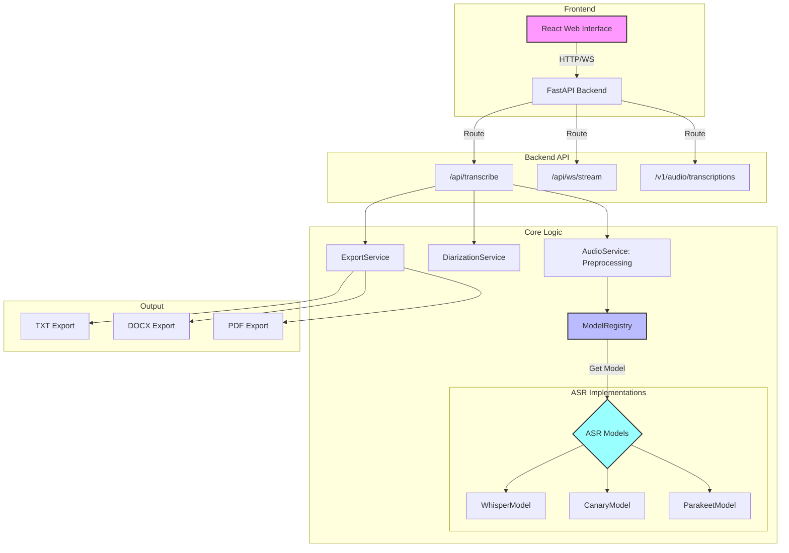

# Modular ASR Platform

A modular, SOLID-compliant speech-to-text backend built with FastAPI, supporting multiple ASR models like Whisper, Canary, and Parakeet.

## Features

- **Multi-Model Support**: Integrated with Whisper-large-v3, NVIDIA Canary, and NVIDIA Parakeet.
- **Modular Architecture**: Built with Abstract Base Classes (ABCs) for high maintainability and loose coupling.
- **Real-time Streaming**: Supports WebSockets for near-real-time streaming transcription.
- **Speaker Diarization**: Handles speaker identification as a separate component.
- **Flexible Export**: Export transcriptions to TXT, DOCX, and PDF formats.
- **Audio Preprocessing**: Automatic normalization (16kHz mono) for optimal model performance.

-----

## Architecture

The system follows a modular architecture where AI models are loaded once into VRAM at startup and managed via a `ModelRegistry`.



## Installation

### Backend Setup

1. **Clone the repository**:
   ```bash
   git clone <repository-url>
   cd modular-asr-platform
   ```

2. **Install dependencies**:
   ```bash
   pip install -r requirements.txt
   ```

3. **Run the server**:
   ```bash
   uvicorn backend.main:app --reload
   ```
   The API will be available at `http://localhost:8000`.

### Frontend Setup

1. **Navigate to the frontend directory**:
   ```bash
   cd frontend
   ```

2. **Install dependencies**:
   ```bash
   npm install
   ```

3. **Run the development server**:
   ```bash
   npm run dev
   ```
   The web interface will be available at `http://localhost:5173`.

-----

## Usage

### 1. Web Interface
Use the React-based web interface to upload audio files, select your preferred ASR model, and view/export results.

### 2. API Endpoints

**Transcribe an audio file:**
```bash
curl -X 'POST' \
  'http://localhost:8000/api/transcribe' \
  -H 'accept: application/json' \
  -H 'Content-Type: multipart/form-data' \
  -F 'model_name=whisper' \
  -F 'file=@audio.wav'
```

**Real-time Streaming (WebSocket):**
Connect to `ws://localhost:8000/api/ws/stream` to send audio chunks and receive transcription feedback.

-----

## Testing

Run the backend test suite to ensure all components are working correctly.

```bash
PYTHONPATH=. pytest tests/
```

## Project Structure

```
/modular-asr-platform
├── backend/               # FastAPI backend
│   ├── api/               # API routers (REST & WebSockets)
│   ├── core/              # Interfaces and Model Registry
│   ├── diarization/       # Diarization logic
│   ├── models/            # ASR model implementations
│   └── services/          # Audio and Export services
├── frontend/              # React frontend
├── tests/                 # Unit tests
├── requirements.txt       # Backend dependencies
└── README.md              # Project documentation
```
